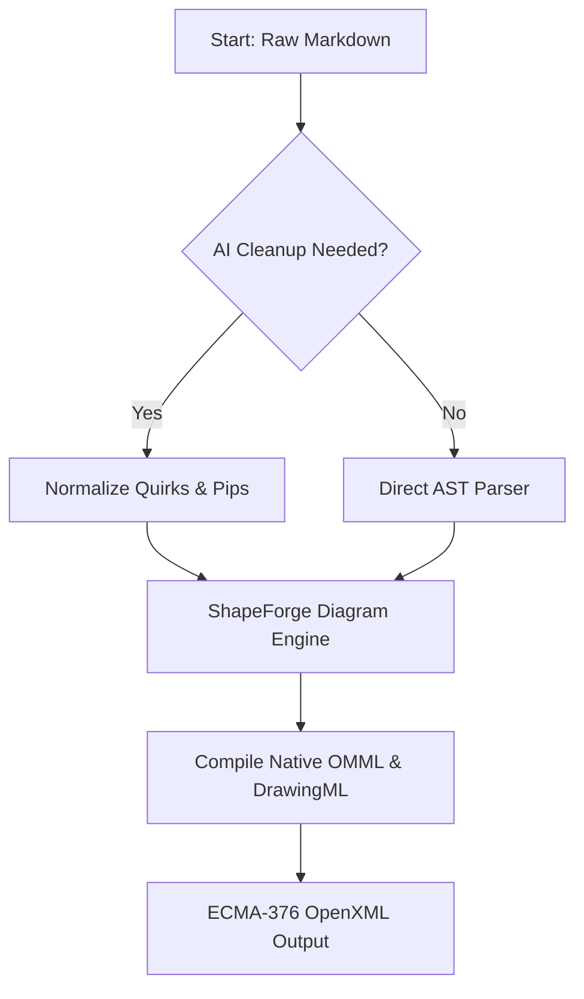
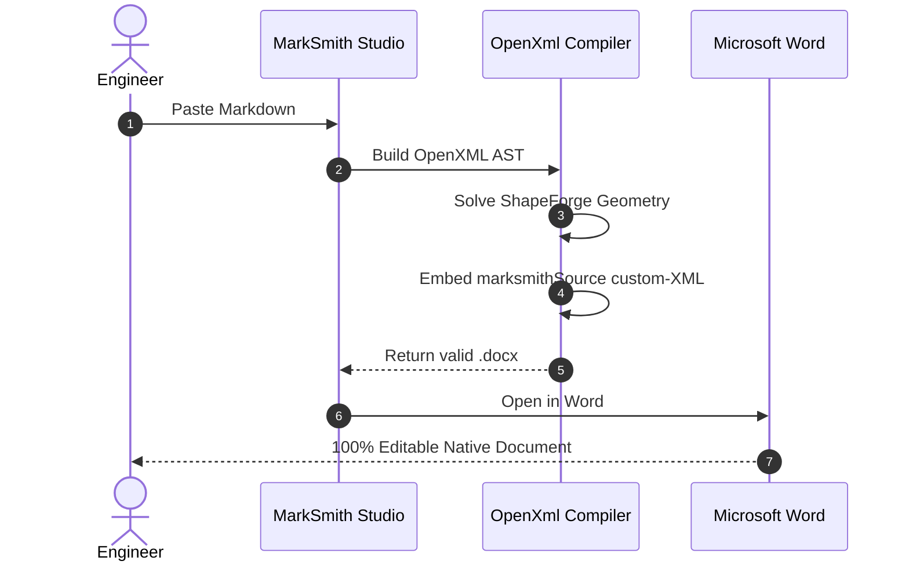

# Massive Markdown Showcase

A comprehensive demonstration of Markdown syntax and extensions compiled to native ECMA-376 Microsoft Word OpenXML by **MarkSmith**.

---

# What It Looks Like (Rendered)

# Heading 1

## Heading 2

### Heading 3

#### Heading 4

##### Heading 5

###### Heading 6

Regular paragraph text with **bold**, *italic*, ***bold italic***, ~~strikethrough~~, `inline code`, and a [link to MarkSmith](https://onyachamp.com/marksmith.html).

---

## Lists

### Unordered

- Apples
- Bananas
  - Yellow
  - Green
  - Small
  - Large
- Oranges

### Ordered

1. First
2. Second
3. Third
   1. Nested
   2. Nested Again

### Task List

- [x] Write Markdown
- [x] Learn tables
- [x] Master diagrams
- [ ] Publish documentation

---

## Quote

> This is a block quote.
>
> It can span multiple paragraphs.
>
> > Nested quote with deep indentation.

---

## Code Blocks

Inline: `print("Hello from MarkSmith")`

Python:

```python
def hello(name):
    return f"Hello {name}"

print(hello("World"))
```

JavaScript:

```javascript
const users = ["Alice", "Bob", "Charlie"];

users.forEach(user => {
    console.log(`Hello ${user}`);
});
```

JSON:

```json
{
  "name": "MarkSmith",
  "engine": "ECMA-376",
  "features": [
    "ShapeForge",
    "OMML",
    "SmartArt",
    "ContrastGuard"
  ]
}
```

Bash / PowerShell:

```bash
git add .
git commit -m "feat: Add Massive Markdown Showcase DOCX sample"
git push origin main
```

---

## Data Tables

| Name | Age | Country | Status |
| :--- | :---: | :--- | :---: |
| Alice | 25 | Canada | Active |
| Bob | 31 | USA | Verified |
| Charlie | 42 | UK | Enterprise |
| Diana | 28 | Australia | Champion |

---

## Alignment Table

| Left Aligned | Center Aligned | Right Aligned |
| :--- | :---: | ---: |
| Apple | Orange | Banana |
| Cat | Dog | Mouse |
| One | Two | Three |

---

## Horizontal Rules

---

Structured section separation.

---

---

## Emoji & Keyboard Keys

😀 😎 🚀 🎉 🔥 ❤️ 💡 📚 ⚡ 🌍

Press <kbd>Ctrl</kbd> + <kbd>Shift</kbd> + <kbd>P</kbd> to open the Command Palette.

---

## Footnotes

Here's a sentence with a reference.[^1]

[^1]: This is the footnote text compiled into Word's native footnote collection.

---

## Collapsible Section

<details>
<summary>Click to expand technical notes</summary>

- Native OpenXML Schema compliance
- Zero COM / Interop runtime dependencies
- Embedded lossless Markdown source in Custom XML

```python
print("Compiled by MarkSmith")
```

</details>

---

# Mermaid Diagrams (ShapeForge™)

## Architecture Flowchart



---

## Sequence Diagram



---

# Mathematical Equations (Native OMML)

Inline equation: $E = mc^2$ and $R = \sum_{i=1}^n p_i \cdot L_i$

Display block equation:

$$
\int_0^\infty e^{-x} dx = 1
$$

Matrix calculation:

$$
\begin{bmatrix}
1 & 2 & 3 \\
4 & 5 & 6 \\
7 & 8 & 9
\end{bmatrix}
$$

---

# ASCII Architecture Diagram

```
Internet
   |
+---------------+
|   Firewall    |
+---------------+
   |
+--------+--------+
|                 |
+---------+      +---------+
| Server1 |      | Server2 |
+---------+      +---------+
    \             /
     \           /
      +---------+
      | Database|
      +---------+
```

---

# Project Tree Structure

```
marksmith/
│
├── README.md
├── LICENSE
├── docs/
│   ├── architecture.md
│   └── openxml-schema.md
├── src/
│   ├── MarkSmith.Core/
│   ├── MarkSmith.Desktop/
│   └── MarkSmith.Cli/
└── tests/
    ├── DocxExportTests.cs
    └── ReverseImportTests.cs
```

---

# Callout Blocks

> [!NOTE]
> This document demonstrates MarkSmith's full compilation pipeline.

> [!TIP]
> Everything here compiles to native Word elements — no blurred screenshot images.

> [!IMPORTANT]
> MarkSmith embeds the exact Markdown source in a private Custom XML part (`customXml/item1.xml`) for lossless round-tripping.

> [!WARNING]
> Legacy COM Word automation is vulnerable to server deadlocks and memory handle leaks under enterprise workloads.

> [!CAUTION]
> Never hardcode OpenXML relationship IDs (`rId1`, `rId2`) into generated document markup.

---

# Gemini 3.8 Frontier Reasoning Trace

<details>
<summary>Gemini 3.8 Deep Reasoning &amp; Architecture Synthesis</summary>

### Step 1: Constraint Verification
Analyzing multi-tenant OpenXML generation constraints. Memory budget: $O(1)$ SAX allocation with streaming paragraph emission.

### Step 2: Vector Geometry Optimization
Computing affine transforms for ShapeForge DrawingML geometry:

$$
\begin{bmatrix}
x' \\
y'
\end{bmatrix}
=
\begin{bmatrix}
\cos\theta & -\sin\theta \\
\sin\theta & \cos\theta
\end{bmatrix}
\begin{bmatrix}
x \\
y
\end{bmatrix}
$$

### Step 3: Schema Validation
Confirming presence of root namespace declarations: `w:`, `a:`, `wp:`, `pic:`, `m:`, `wpg:`, `wps:`, `w15:`. All required structures compiled.

</details>

---

# Code Interpreter Execution Card

```output
[MarkSmith Kernel]: Document compiled successfully in 38ms.
[Diagnostics]: 0 schema violations, 14 vector shapes synthesized.
[Memory Profile]: 18.2 MB heap allocation, O(1) streaming SAX pipeline.
```

---

# Multi-Column Layout

:::columns count="2"
### Architecture Advantages
- **Pure .NET Core Engine**: Runs anywhere .NET 8 runs.
- **Mathematical Layout Solver**: Precise bounding box calculations.
- **Native OMML Equations**: Direct math editor integration.

### Enterprise Compliance
- **Zero-Installation Footprint**: No Microsoft Office license on server.
- **WCAG 2.1 AA Contrast**: Guaranteed legible text ratios.
- **DLP Protection**: Offline AST transformation.
:::

---

# Hyperlinked Research Citations

MarkSmith leverages the OpenXML SDK for high-performance document generation[^1], eliminating the need for Office interop[^2].

[^1]: ECMA-376 5th Edition: Office Open XML File Formats standard.
[^2]: Microsoft Knowledge Base: Considerations for server-side Automation of Office.

---

# Nested Example

> ## Quarterly Milestone Summary
>
> - Phase 1: Planning & Architecture (Completed)
> - Phase 2: ShapeForge DrawingML Compiler (Completed)
> - Phase 3: Enterprise Template Injection (Completed)
>
> | Phase | Completion | Status |
> | :--- | :---: | :---: |
> | Core Engine | 100% | Verified |
> | ShapeForge | 100% | Verified |
> | OMML Math | 100% | Verified |

---

## References

1. [ECMA-376 Specification](https://www.ecma-international.org/publications-and-standards/standards/ecma-376/)
2. [OpenXML SDK GitHub Repository](https://github.com/dotnet/Open-XML-SDK)
3. [MarkSmith Official Documentation](https://onyachamp.com/marksmith.html)
